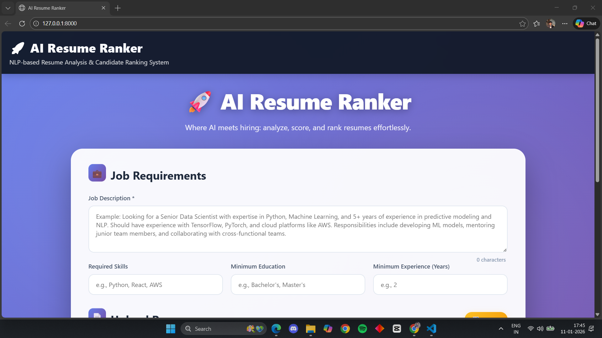
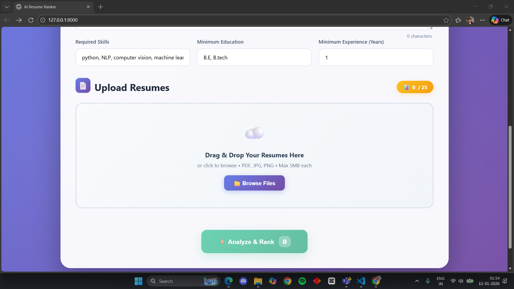
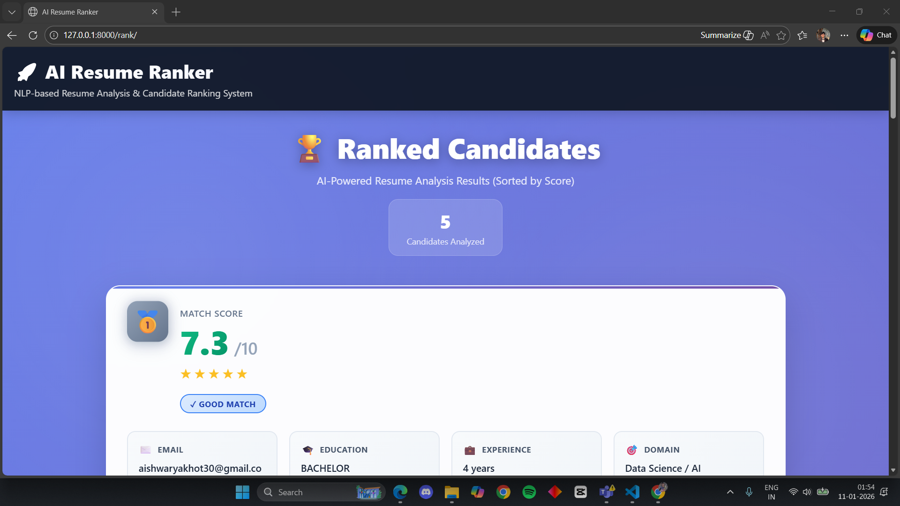
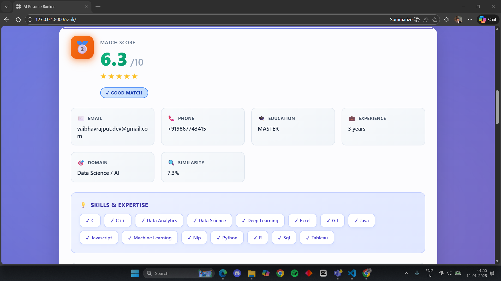

````markdown
# 🚀 AI Resume Ranker – ATS-Based Resume Screening System


---

## 📌 Project Overview

**AI Resume Ranker** is an ATS-style web application that automatically analyzes resumes and ranks candidates against a given job description.  
It uses **OCR, NLP, and semantic similarity techniques** to extract candidate information and generate a fair, explainable match score out of 10.

Designed to simulate **real-world Applicant Tracking Systems**, this project focuses on accuracy, robustness, and transparency.

---

## 🎯 Objective

Design an **NLP-based system** that:
- Extracts structured information from resumes
- Understands professional qualifications
- Ranks candidates based on job relevance using ATS logic

---

## 🧩 Problem Statement

Recruiters receive resumes in multiple formats and layouts.  
Manually screening them is time-consuming and inconsistent.

This system:
- Accepts resumes in **PDF / Image format**
- Handles scanned documents using OCR
- Resolves vocabulary mismatch between resumes and job descriptions
- Produces **explainable, normalized match scores**

---

## 📥 Input

- Resume documents (`PDF`, `JPG`, `PNG`)
- Job description text

---

## 📤 Output

Structured candidate profile:

```json
{
  "name": "Candidate Name",
  "email": "candidate@email.com",
  "skills": ["Python", "NLP", "Machine Learning"],
  "education": "Highest Degree",
  "experience_years": 2.5,
  "experience_level": "Junior",
  "domain": "Data Science / AI",
  "match_score": 8.6
}
````

---

## ⚠️ Constraints & Challenges

* Highly varied resume formats
* Scanned resumes requiring OCR
* Inconsistent skill terminology
* Noisy or missing information
* Need for fair & explainable ranking

---

## 🧠 Core Concepts Applied

* 🖨️ OCR (Tesseract + PDF parsing)
* 🧹 Text preprocessing & normalization
* 🧾 Named Entity Recognition (spaCy)
* 🎓 Rule-based education & experience extraction
* 🔗 Sentence embeddings (Sentence Transformers)
* 📐 Semantic similarity (Cosine Similarity)
* 📊 ATS-style weighted scoring
* 💡 Explainable AI outputs

---

## 🛠️ Tech Stack

| Layer     | Technologies                  |
| --------- | ----------------------------- |
| Backend   | Python, Django                |
| NLP       | spaCy, Sentence-Transformers  |
| OCR       | Tesseract OCR, PyMuPDF        |
| ML        | Cosine Similarity, Embeddings |
| Frontend  | HTML, CSS, JavaScript         |
| Utilities | NumPy                         |

---

## ✨ Key Features

* 📄 Multi-format resume upload (PDF / Image)
* 🔍 OCR-based text extraction (scanned + digital)
* 🧠 Offline NLP-based information extraction
* 📐 Semantic similarity with job description
* 🏷️ ATS-style scoring (0–10 scale)
* 🏆 Ranked candidate list
* 💬 Explainable AI ranking logic
* 🎨 Clean, responsive UI

---

## 🔄 Demo Flow

**Upload Resumes → OCR & NLP Processing → Semantic Matching → ATS Scoring → Ranked Output**

---

## 🏗️ System Architecture / Workflow

1. Resume Upload
2. OCR Text Extraction
3. Text Cleaning & Normalization
4. NLP-based Entity Extraction
5. Job Description Processing
6. Embedding Generation
7. Semantic Similarity Computation
8. Skill Overlap Analysis
9. Final Weighted Score Calculation
10. Ranking & Visualization

---

## 📁 Project Structure

```
resume_ranker/
│
├── core/
│   ├── services/
│   │   ├── ocr_service.py
│   │   ├── cleaning_service.py
│   │   ├── genai_service.py
│   │   ├── embedding_service.py
│   │   ├── similarity_service.py
│   │   ├── scoring_service.py
│   │   └── explanation_service.py
│   │
│   ├── pipelines/
│   │   └── resume_pipeline.py
│
├── templates/
│   ├── base.html
│   ├── index.html
│   └── results.html
│
├── static/
│   ├── css/
│   └── images/
│
├── media/
│   └── resumes/
│
├── requirements.txt
├── manage.py
└── README.md
```

---

## ▶️ How to Run the Project (Windows)

### 1️⃣ Clone Repository

```bash
git clone https://github.com/your-username/ai-resume-ranker.git
cd resume-ranker
```

### 2️⃣ Create Virtual Environment

```bash
python -m venv venv
venv\Scripts\activate
```

### 3️⃣ Install Dependencies

```bash
pip install -r requirements.txt
```

### 4️⃣ Install spaCy Model

```bash
python -m spacy download en_core_web_sm
```

### 5️⃣ Configure Tesseract OCR

* Install Tesseract OCR
* Update path in `ocr_service.py` if needed

### 6️⃣ Run Server

```bash
python manage.py runserver
```

### 7️⃣ Access Application

```
http://127.0.0.1:8000
```

---

## 📦 requirements.txt (Key Versions)

* django>=4.2
* spacy>=3.7
* sentence-transformers>=2.2
* pytesseract>=0.3
* pdf2image>=1.16
* pymupdf>=1.23
* pillow>=10.0
* numpy>=1.24
* python-dotenv>=1.0

---

## 🧪 Evaluation Criteria

* Accuracy of extracted information
* Quality of ranking
* Robustness across resume formats
* Interpretability of match scores

---

## 🖼️ Screenshots

### 🏠 Home Page


### 📤 Resume Upload


### 🏆 Ranking Results


### 👤 Candidate Details


---

## 🛠️ Troubleshooting

* **OCR not working** → Check Tesseract installation path
* **spaCy errors** → Ensure model is downloaded
* **Low accuracy** → Improve skill taxonomy & rules

---

## 🚀 Future Enhancements

* Resume section-wise parsing
* Skill proficiency estimation
* Role-based scoring profiles
* Cloud deployment (Docker / AWS)
* Admin analytics dashboard

---

## 🤝 Contributing

Contributions are welcome!
Fork the repository, create a feature branch, and submit a pull request.

---

## 📜 License

This project is licensed under the **MIT License**.

---

## 👨‍💻 Author

**Shubham Bankar**
Data Science & AI Enthusiast
Focused on NLP, ML, and real-world AI systems

---

⭐ If you found this project useful, don’t forget to star the repository!

```
```
